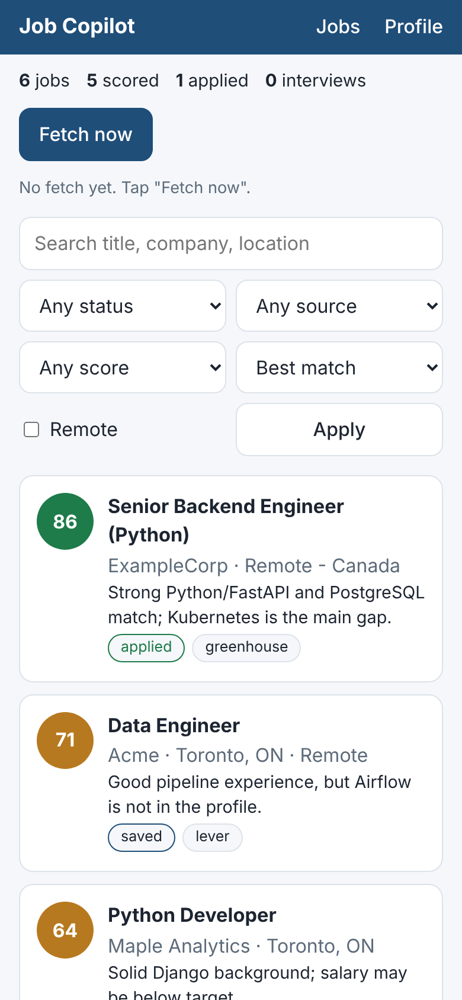
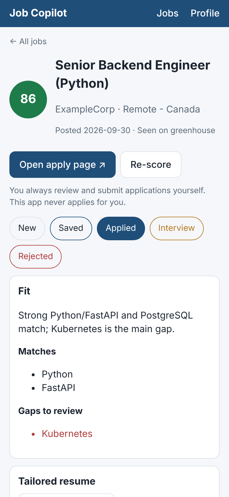
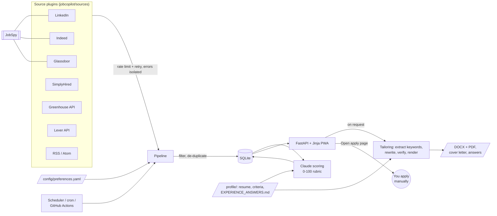

# Job Search Copilot

[](https://github.com/Tirthpatel13/job-search-copilot/actions/workflows/ci.yml)


A self-hosted job search assistant. It pulls listings from several job boards,
removes duplicates, ranks every job against **your** profile with Claude, and
tailors a truthful, ATS-friendly resume and cover letter for the jobs you pick.
It runs as an installable web app, so you can use it from your phone.

> **You stay in control.** The app fetches, scores, drafts and tailors. It never
> submits an application. You review everything and apply yourself.

| Job list (phone) | Job detail (phone) |
|---|---|
|  |  |

<sub>Screenshots use demo data. Replace them with your own in `docs/screenshots/`.</sub>

## Contents

- [Design principles](#design-principles)
- [Features](#features)
- [Architecture](#architecture)
- [Quick start](#quick-start)
- [Configuration](#configuration)
- [Using the app](#using-the-app)
- [Automation](#automation)
- [Deployment](#deployment-use-it-from-your-phone)
- [Legal and ToS notes](#legal-and-tos-notes)
- [Development](#development)
- [Publishing to GitHub](#publishing-to-github)
- [Roadmap](#roadmap)

## Design principles

**Human in the loop.** The system may fetch, score, draft and tailor, but it never
auto-submits an application, fills a form, or contacts an employer. The job page
has an "Open apply page" button that opens the employer's listing; you read,
decide and submit. This is a deliberate safety feature: automated mass-applying
is spammy, often violates platform terms, and puts your name on content you have
not checked.

**No fabrication.** Every AI output (fit reasons, resume rewrites, cover letters,
application answers) may only use facts from your profile folder. This is enforced
in three layers:

1. **Prompting.** Every Claude call carries the same grounding rules: use only the
   profile, never invent skills, employers, dates, metrics or achievements, and
   report unsupported requirements as gaps.
2. **Deterministic verification** (`jobcopilot/tailoring.py::verify_resume`).
   After Claude rewrites a resume, code removes any employer, school, skill or
   certification that does not literally appear in your profile, and flags any
   number (like "35%") that is not in your profile.
3. **Visible review.** Gaps, removed items, unverified figures and unanswered
   application questions are shown in red on the job page. Cover letters are
   always labelled as drafts to review.

## Features

- **Multi-board aggregation:** LinkedIn, Indeed, Glassdoor (via
  [JobSpy](https://github.com/speedyapply/JobSpy)), SimplyHired, public
  **Greenhouse** and **Lever** boards (official JSON APIs), and any **RSS/Atom** feed.
- **Pluggable sources:** a new board is one small class with a `fetch()` method.
- **Resilient fetching:** per-source rate limiting, retries with exponential
  backoff, and error isolation, so one blocked site never breaks a run. Failures
  are shown in the UI.
- **Cross-platform de-duplication:** the same role on three boards becomes one
  row that remembers every source.
- **Preference filters** in `config/preferences.yaml`: titles, locations, remote,
  include/exclude keywords, excluded companies, seniority.
- **Claude scoring (0-100)** against a fixed rubric, with a one-sentence reason,
  matched requirements and gaps. Sort and filter by score.
- **Truthful resume tailoring:** keyword extraction, rewrite, verification, a
  before/after keyword match score, and **DOCX + PDF** output in an ATS-friendly
  format (single column, standard headings, no tables/images/text boxes,
  standard fonts).
- **Cover letter drafts** grounded in your profile, always flagged for review.
- **Application question answers** drawn from `EXPERIENCE_ANSWERS.md`;
  anything it doesn't cover is flagged for you to answer.
- **Application tracking:** new, saved, applied, interview, rejected, plus notes.
- **Installable PWA:** responsive, add-to-home-screen, offline fallback.
- **Automation:** in-app scheduler, a CLI for cron, and a GitHub Actions workflow
  that commits results to `data/evaluated-jobs.csv`.
- **Docker** image and compose file; optional password protection.

## Architecture



**Stack:** FastAPI + server-rendered Jinja templates + vanilla JS + SQLite. One
Python process and one database file, no build step, and pages that load fast
on a phone. Claude is called through the official `anthropic` SDK with
structured outputs (Pydantic schemas), so every response is validated JSON.

```
job-search-copilot/
├── jobcopilot/
│   ├── config.py           # settings from environment / .env
│   ├── models.py           # Job, Status
│   ├── preferences.py      # YAML preferences + filtering
│   ├── dedup.py            # normalisation, fingerprints, merging
│   ├── db.py               # SQLite repository, CSV import/export
│   ├── profile.py          # profile folder, PDF/DOCX/MD/TXT parsing
│   ├── llm.py              # Claude client + grounding rules
│   ├── scoring.py          # 0-100 rubric scoring
│   ├── tailoring.py        # resume, cover letter, answers, verification
│   ├── documents.py        # ATS-friendly DOCX/PDF rendering
│   ├── pipeline.py         # fetch -> filter -> dedupe -> store -> score
│   ├── scheduler.py        # optional in-process periodic fetch
│   ├── cli.py              # command-line interface
│   ├── sources/            # one module per job source (plugins)
│   └── web/                # FastAPI app, templates, PWA assets
├── config/preferences.example.yaml
├── profile.example/        # example resume, criteria, EXPERIENCE_ANSWERS.md
├── tests/                  # pytest suite (Claude mocked)
├── scripts/make_icons.py   # regenerates the PWA PNG icons
├── .github/workflows/      # ci.yml, fetch-jobs.yml
├── Dockerfile, docker-compose.yml
└── data/evaluated-jobs.csv # written by the scheduled workflow
```

## Quick start

Requires Python 3.10+ and an [Anthropic API key](https://console.anthropic.com/).

```bash
git clone https://github.com/Tirthpatel13/job-search-copilot.git
cd job-search-copilot
python -m venv .venv
source .venv/bin/activate            # Windows: .venv\Scripts\activate
pip install -r requirements.txt

cp .env.example .env                 # then set ANTHROPIC_API_KEY in .env
cp config/preferences.example.yaml config/preferences.yaml
mkdir -p profile
cp profile.example/criteria.md profile.example/EXPERIENCE_ANSWERS.md profile/
cp /path/to/your/resume.pdf profile/resume.pdf   # or .docx / .md / .txt

python -m jobcopilot.cli serve       # open http://localhost:8000
```

Tap **Fetch now**, or run `python -m jobcopilot.cli run` in another terminal.
Until you add your own resume, the app uses the example profile and says so.

With Docker instead:

```bash
cp .env.example .env                 # set ANTHROPIC_API_KEY
mkdir -p profile data output && cp profile.example/* profile/
docker compose up -d --build         # http://localhost:8000
```

## Configuration

### Environment (`.env`)

| Variable | Default | Purpose |
|---|---|---|
| `ANTHROPIC_API_KEY` | (none) | Required for scoring and tailoring. Never commit it. |
| `CLAUDE_MODEL` | `claude-opus-5-5` | Any current Claude model id. |
| `CLAUDE_EFFORT` | `medium` | `low`, `medium`, `high`, `xhigh` or `max`. Lower is cheaper. |
| `CLAUDE_FALLBACKS` | `default` | Server-side refusal fallbacks; `off` to disable. |
| `DATABASE_PATH` | `data/jobs.db` | SQLite file. |
| `PROFILE_DIR` | `profile` | Your profile folder (git-ignored). |
| `PREFERENCES_FILE` | `config/preferences.yaml` | Falls back to the example. |
| `OUTPUT_DIR` | `output` | Generated resumes and cover letters. |
| `APP_PASSWORD` | (empty) | Enables HTTP Basic auth (any username). Set it before exposing the app. |
| `SCHEDULE_FETCH_HOURS` | `0` | Fetch every N hours while the web app runs. |
| `JOBSPY_PROXIES` | (empty) | Optional proxies for JobSpy, comma separated. |

### Preferences (`config/preferences.yaml`)

See [`config/preferences.example.yaml`](config/preferences.example.yaml). Key ideas:

- `search.titles` are search terms **and** a title filter: a job passes if its
  title contains every word of at least one entry ("Backend Engineer" matches
  "Senior Backend Software Engineer").
- `search.locations` accepts `Remote` and city strings. `remote_only: true`
  keeps only remote jobs.
- `filters.seniority` uses levels inferred from the title: `intern`, `junior`,
  `mid`, `senior`, `lead`, `manager`.
- Each source can be switched on or off; Greenhouse needs board tokens, Lever
  needs company slugs, RSS needs feed URLs.
- `scoring.max_jobs_per_run` caps Claude calls (and cost) per run.

### Profile folder (`profile/`)

| File | What to put in it |
|---|---|
| `resume.pdf` / `.docx` / `.md` / `.txt` | Your base resume. Also uploadable from the Profile page. |
| `criteria.md` | Target roles, must-haves, nice-to-haves, deal-breakers, work authorization. |
| `EXPERIENCE_ANSWERS.md` | Vetted, true answers to common application questions. |

Claude only uses these files. If something is not in them, it is reported as a
gap or a question for you rather than guessed. Examples are in
[`profile.example/`](profile.example/).

### Adding a source

```python
# jobcopilot/sources/myboard.py
from ..models import Job
from .base import JobSource, register


@register
class MyBoardSource(JobSource):
    name = "myboard"

    def fetch(self) -> list[Job]:
        with self.client() as client:
            data = self.http_get(client, "https://example.com/jobs.json").json()
        return [
            Job(
                title=d["title"],
                company=d["company"],
                location=d["location"],
                url=d["url"],
                source=self.name,
            )
            for d in data
        ]
```

Import it in `jobcopilot/sources/__init__.py` and enable it in preferences:
`myboard: {enabled: true}`. `http_get` already applies rate limiting and retries,
and the pipeline isolates any exception.

## Using the app

1. **Fetch.** Tap *Fetch now* (or wait for the schedule). Failed sources are
   listed under the button, and the rest still load.
2. **Triage.** Jobs are sorted by score. Filter by score, status, source or
   remote, or search text.
3. **Review fit.** The job page shows the one-sentence reason, matches and gaps.
4. **Tailor.** *Tailor my resume* shows keyword match before and after, keywords
   gained, keywords that are not in your profile (and were not added), anything
   the verifier removed, and DOCX/PDF downloads.
5. **Draft.** *Draft cover letter* and *Draft answers* (paste a form's questions,
   one per line). Unanswerable questions are flagged for you.
6. **Apply yourself.** *Open apply page*, submit manually, then mark the job
   *Applied* and keep notes.

### CLI

```bash
python -m jobcopilot.cli run                 # fetch + score
python -m jobcopilot.cli fetch               # fetch only
python -m jobcopilot.cli score --limit 20    # score unscored jobs
python -m jobcopilot.cli tailor <job_id>     # tailored DOCX/PDF for one job
python -m jobcopilot.cli export jobs.csv     # CSV export
python -m jobcopilot.cli serve --port 8000   # web app
```

## Automation

**In-app scheduler:** set `SCHEDULE_FETCH_HOURS=24` (docker-compose sets 24 by default).

**cron** (on a machine that stays on):

```cron
0 8 * * * cd /path/to/job-search-copilot && .venv/bin/python -m jobcopilot.cli run >> data/cron.log 2>&1
```

**GitHub Actions** (`.github/workflows/fetch-jobs.yml`) runs every morning at
13:00 UTC and on demand (`workflow_dispatch`). It fetches, scores, uploads
`data/evaluated-jobs.csv` as an artifact, and commits it. The CSV is re-imported
on each run, so jobs that already have a score are not scored again.

To set it up:

1. In your repository, open **Settings**, then **Secrets and variables**, then **Actions**.
2. Click **New repository secret**, name it `ANTHROPIC_API_KEY`, paste your key, and save.
3. Optional: add secrets `PROFILE_RESUME_MD`, `PROFILE_CRITERIA_MD` and
   `PROFILE_ANSWERS_MD` with the Markdown contents of your profile files.
   Without them, the example profile is used for scoring.
4. Optional: add a repository **variable** `CLAUDE_MODEL` to override the model.
5. Run it once from the **Actions** tab with **Run workflow**.

The workflow uses `config/preferences.yaml` if you commit one, otherwise the
example file. Scores and gaps say something about you, so consider keeping the
repository private if you enable this workflow.

## Deployment (use it from your phone)

The PWA install prompt needs HTTPS (or `localhost`). Pick one:

- **[GitHub Codespaces](https://github.com/features/codespaces)** (free monthly
  hours, nothing to install, works from a phone browser). On the repo page tap
  **Code → Codespaces → Create codespace on main**. The app starts on port 8000,
  seeded with the jobs from `data/evaluated-jobs.csv`; open the **Ports** tab and
  tap the globe icon for its private HTTPS URL. Add `ANTHROPIC_API_KEY` under
  **Settings → Codespaces → Secrets** (separate from the Actions secret) to score
  and tailor. Codespaces stop when idle, so this is for sessions, not always-on.
- **Home machine or Raspberry Pi + [Tailscale](https://tailscale.com/)** (free,
  private, recommended). Run `docker compose up -d`, then `tailscale serve --bg 8000`
  to get an HTTPS URL that only your devices can reach.
- **[Fly.io](https://fly.io/)** (low cost). `fly launch` detects the Dockerfile.
  Then `fly volumes create data --size 1`, mount it at `/app/data`, and set
  secrets with `fly secrets set ANTHROPIC_API_KEY=... APP_PASSWORD=...`. Point
  `PROFILE_DIR` and `OUTPUT_DIR` at folders on the volume (for example
  `/app/data/profile`) so they persist, and upload your resume from the Profile page.
- **Any VPS** (Oracle Cloud free tier, Hetzner, and so on): install Docker,
  `docker compose up -d`, and put [Caddy](https://caddyserver.com/) in front for HTTPS.

Always set `APP_PASSWORD` when the app is reachable from the internet; it holds
your resume and application history. Then open the URL on your phone and choose
**Add to Home Screen** (iOS: Share menu; Android: browser menu or install banner).

## Legal and ToS notes

This is a personal tool. You are responsible for how you use it. Keep volumes
low, keep rate limits on, and disable any source whose terms you are not
comfortable with.

| Source | Method | Terms / risk |
|---|---|---|
| Greenhouse | Official public Job Board API | Intended for this use. Low risk. |
| Lever | Official public Postings API | Intended for this use. Low risk. |
| RSS / Atom | Published feeds | Intended for consumption. Low risk. |
| LinkedIn | JobSpy, logged-out guest search pages | LinkedIn's User Agreement prohibits scraping and automated access, and it rate-limits hard (HTTP 429 after a few pages per IP). Never use your account credentials with it. Medium-high risk of IP blocks. |
| Indeed | JobSpy, Indeed's mobile search API | Indeed's terms prohibit automated scraping; its public Publisher API is closed to new users. Medium risk of blocks. |
| Glassdoor | JobSpy, internal search API | Terms prohibit scraping; strong anti-bot protection, so it often fails. Medium-high risk. |
| SimplyHired | Parses the search page's embedded JSON | No public API; terms prohibit automated access; layout changes break the parser. Medium risk. |

Anti-bot risks in practice: IP rate limits and blocks, CAPTCHAs, and silent empty
results. The app records them as source errors instead of crashing. Rotating
proxies (`JOBSPY_PROXIES`) reduce blocks but may further conflict with site
terms. Nothing here bypasses logins or CAPTCHAs.

**About "Obsidian":** I could not identify a job board called Obsidian (Obsidian
is best known as a note-taking app). Public **Greenhouse** and **Lever** company
boards plus generic **RSS** feeds are included as the closest legitimate,
API-based equivalent. If you meant a specific site, add it as a source plugin
(see [Adding a source](#adding-a-source)).

**Claude usage:** profile text and job descriptions are sent to the Anthropic API
for scoring and tailoring. Review Anthropic's data policies before adding
sensitive information to your profile.

## Development

```bash
pip install -r requirements-dev.txt
pytest                     # 77 tests, Claude fully mocked, no network
ruff check . && ruff format --check .
python scripts/make_icons.py   # regenerate PWA icons
```

The tests cover parsing for every source, de-duplication, preference filters,
storage and CSV round trips, scoring (including the exact API request shape),
the tailoring pipeline end to end with a fake Claude (including removal of
invented employers, skills and certifications, and DOCX/PDF checks), and the web
app (status changes, downloads, path traversal, password protection, PWA assets).

## Publishing to GitHub

```bash
cd job-search-copilot
git init -b main

git add pyproject.toml requirements.txt requirements-dev.txt .gitignore .dockerignore LICENSE .env.example
git commit -m "chore: project scaffolding and dependencies"

git add jobcopilot/__init__.py jobcopilot/config.py jobcopilot/models.py jobcopilot/preferences.py jobcopilot/dedup.py jobcopilot/sources config/
git commit -m "feat: pluggable job sources, preference filters and de-duplication"

git add jobcopilot/db.py jobcopilot/pipeline.py jobcopilot/scheduler.py jobcopilot/cli.py data/.gitkeep
git commit -m "feat: SQLite storage, fetch pipeline, scheduler and CLI"

git add jobcopilot/llm.py jobcopilot/profile.py jobcopilot/scoring.py profile.example/
git commit -m "feat: Claude scoring against a grounded candidate profile"

git add jobcopilot/tailoring.py jobcopilot/documents.py
git commit -m "feat: truthful resume tailoring, cover letters and ATS documents"

git add jobcopilot/web scripts/
git commit -m "feat: mobile-first installable web app"

git add tests/
git commit -m "test: unit and integration tests with Claude mocked"

git add .github/ Dockerfile docker-compose.yml
git commit -m "ci: test/lint workflow, scheduled fetch workflow and Docker"

git add README.md docs/
git commit -m "docs: README, architecture and screenshots"

git status   # should be clean; profile/, .env and *.db must NOT appear

# Create the repo with the GitHub CLI...
gh repo create job-search-copilot --public --source=. --remote=origin --push
# ...or create an empty repo on github.com, then:
git remote add origin https://github.com/<your-username>/job-search-copilot.git
git push -u origin main
```

If you fork this, replace `Tirthpatel13` in the badge URLs above and in `jobcopilot/sources/base.py`
(the User-Agent), and the name in `LICENSE`.

**Suggested description:** *Human-in-the-loop job search copilot: aggregates
listings from multiple boards, ranks them against your profile with Claude, and
tailors truthful ATS-friendly resumes. FastAPI + SQLite + installable PWA.*

**Suggested topics:** `job-search`, `fastapi`, `python`, `claude`, `anthropic`,
`llm`, `resume`, `ats`, `pwa`, `sqlite`, `web-scraping`, `automation`,
`github-actions`, `docker`

## Roadmap

- [ ] Email or push digest of new high-scoring jobs
- [ ] Batch scoring through the Message Batches API (about half the cost)
- [ ] Interview prep notes per job, grounded in the profile
- [ ] Multiple base resumes (for example, backend vs. data) with automatic selection
- [ ] Salary normalisation and filtering
- [ ] Workday, Ashby and SmartRecruiters public board sources
- [ ] Kanban view of the application pipeline
- [ ] Optional Postgres for multi-device hosting

## License

[MIT](LICENSE)
